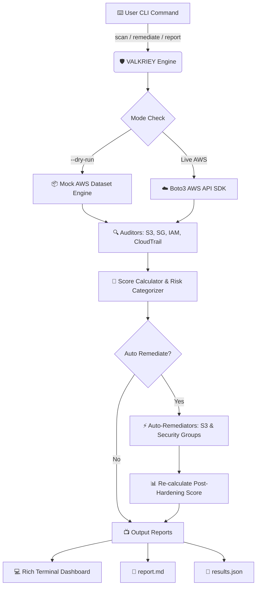

<div align="center">

```text
 __   _____   _    _  _______  _____  _____ ________   __
 \ \ / / _ \ | |  | |/ /  __ \|_   _||  ____|\ \ \ / /   
  \ V / /_\ \| |  |  ' /| |__) | | |  | |__   \ \ V /    
   > /  _  || |  |  <  |  _  /  | |  |  __|   \ \ /     
  / /| | | || |__| . \ | | \ \ _| |_ | |____   | |      
 \/  \_| |_/\____/|_|\_\|_|  \_\_____|______|  |_|      
```

# 🛡️ VALKRIEY
### Multi-Cloud Security Hardening & CIS Compliance Auditor CLI

[](https://www.python.org/)
[](https://opensource.org/licenses/MIT)
[](https://boto3.amazonaws.com/v1/documentation/api/latest/index.html)
[](https://www.cisecurity.org/benchmark/amazon_web_services)
[](https://peps.python.org/pep-0008/)

*An enterprise-grade, high-performance CLI tool for automated AWS security auditing, compliance scoring, and one-click auto-remediation.*

[Features](#-key-features) • [Workflow](#%EF%B8%8F-architecture--workflow) • [Rules](#-cis-benchmark-rule-coverage) • [Quickstart](#-quickstart--installation) • [CLI Commands](#-cli-command-reference)

</div>

---

## ⚡ Executive Summary

**VALKRIEY** is an open-source cybersecurity automation tool designed for Cloud Security Engineers, DevOps practitioners, and Security Auditors. It identifies critical cloud misconfigurations across AWS S3, EC2 Security Groups, IAM, and CloudTrail against **CIS AWS Foundations Benchmarks**, computes weighted compliance risk scores, generates executive Markdown/JSON reports, and offers **simulated or live auto-remediation** to instantly remediate security gaps.

---

## 🔥 Key Features

- 🔍 **Automated CIS Benchmark Auditing**: Deep inspection of AWS S3, Security Groups, IAM, and CloudTrail services.
- ⚡ **Automated Remediation Engine**: Safely block public S3 buckets (`BlockPublicAccess`) and revoke unrestricted `0.0.0.0/0` ingress rules on sensitive ports (`22`, `3389`, `5432`, `27017`).
- 🧪 **Offline Dry-Run Mode (`--dry-run`)**: Test full scans and simulated auto-remediations offline using realistic mock AWS datasets — **no AWS credentials required**.
- 📊 **Dynamic Compliance Scoring**: Evaluates overall compliance percentage `(Passed Checks / Total Checks) * 100%` and assigns risk categories: `KRITIS`, `TINGGI`, `SEDANG`, `RENDAH`.
- 🎨 **Rich Terminal Visualizer**: Interactive terminal UI powered by `Rich` featuring status panels, progress spinners, color badges, and structured tables.
- 📄 **Executive Reporting**: Exports audit results to `results.json` and `report.md` complete with **Pre-Hardening vs Post-Hardening score comparison tables**.
- 🛡️ **Fault-Tolerant AWS Engine**: Built-in exception handling for AWS API rate limit throttling (`Throttling`, `RequestLimitExceeded`) and missing credentials.

---

## 🏗️ Architecture & Workflow



---

## 🖥️ Terminal UI Preview

```text
 ╭───────────────────────── 🛡️ VALKRIEY Security Suite ─────────────────────────╮
 │                                                                              │
 │  __   _____   _    _  _______  _____  _____ ________   __                    │
 │  \ \ / / _ \ | |  | |/ /  __ \|_   _||  ____|\ \ \ / /                       │
 │   \ V / /_\ \| |  |  ' /| |__) | | |  | |__   \ \ V /                        │
 │    > /  _  || |  |  <  |  _  /  | |  |  __|   \ \ /                          │
 │   / /| | | || |__| . \ | | \ \ _| |_ | |____   | |                           │
 │  \/  \_| |_/\____/|_|\_\|_|  \_\_____|______|  |_|                           │
 │    Multi-Cloud Security Hardening & CIS Compliance Auditor                   │
 │                                                                              │
 ╰──────────────────────────────────────────────────────────────────────────────╯
 
 ╭─────────────────────── 📊 Compliance Audit Dashboard ────────────────────────╮
 │ Compliance Score: 69.23%                                                     │
 │ Overall Risk Category: [TINGGI]                                              │
 │                                                                              │
 │ Total Checks  : 26                                                           │
 │ Passed Checks : 18 | Failed Checks : 8 | Remediated : 4                      │
 │                                                                              │
 │ [PRE-HARDENING SCORE : 53.85% -> POST-HARDENING SCORE : 69.23%]              │
 ╰──────────────────────────────────────────────────────────────────────────────╯
```

---

## 📋 CIS Benchmark Rule Coverage

| Rule ID | Service | Security Check Description | Severity | Remediable? |
| :--- | :---: | :--- | :---: | :---: |
| **`CIS-AWS-2.1.5`** | `S3` | Ensure S3 Buckets Have Public Access Block Enabled | **`KRITIS`** | ✅ Yes |
| **`CIS-AWS-2.1.1`** | `S3` | Ensure S3 Bucket Server-Side Encryption is Enabled | **`TINGGI`** | ❌ Manual |
| **`CIS-AWS-2.1.2`** | `S3` | Ensure S3 Bucket Server Access Logging is Enabled | **`SEDANG`** | ❌ Manual |
| **`CIS-AWS-5.2`** | `EC2/VPC` | Ensure No Security Groups Allow Inbound 0.0.0.0/0 on Sensitive Ports (`22`, `3389`, `5432`, `27017`) | **`KRITIS`** | ✅ Yes |
| **`CIS-AWS-1.1`** | `IAM` | Avoid Root User Access Key Usage & Require MFA | **`KRITIS`** | ❌ Manual |
| **`CIS-AWS-1.5`** | `IAM` | Ensure MFA is Enabled for All IAM Users | **`TINGGI`** | ❌ Manual |
| **`CIS-AWS-1.12`** | `IAM` | Ensure Credentials Unused for 90+ Days Are Deactivated | **`TINGGI`** | ❌ Manual |
| **`CIS-AWS-1.16`** | `IAM` | Ensure Admin Policies Attached Only to Groups/Roles, Not Users | **`SEDANG`** | ❌ Manual |
| **`CIS-AWS-3.1`** | `CloudTrail` | Ensure CloudTrail is Enabled Across All Regions | **`KRITIS`** | ❌ Manual |
| **`CIS-AWS-3.2`** | `CloudTrail` | Ensure CloudTrail Log File Validation is Enabled | **`TINGGI`** | ❌ Manual |

---

## 🚀 Quickstart & Installation

### Prerequisites
- **Python 3.10+**
- **AWS CLI** configured (`aws configure`) *— Optional if using `--dry-run` mode.*

### 1. Clone & Setup Virtual Environment

```bash
git clone https://github.com/kevinnsetiawan/valkriey-cloud-auditor.git
cd valkriey-cloud-auditor

# Create & activate virtual environment
python -m venv venv

# On Windows PowerShell:
.\venv\Scripts\Activate.ps1

# On Linux/macOS:
source venv/bin/activate
```

### 2. Install Package

```bash
pip install -e .
```

---

## 💻 CLI Command Reference

### `valkriey scan`
*Run security audit against target AWS infrastructure or dry-run mock dataset.*

```bash
# Scan live AWS infrastructure in default region (us-east-1)
valkriey scan

# Scan specific AWS region
valkriey scan --region ap-southeast-1

# Run offline scan in DRY-RUN mode (No AWS credentials needed)
valkriey scan --dry-run
```

### `valkriey remediate`
*Audit infrastructure and auto-remediate fixable security misconfigurations.*

```bash
# Run auto-remediation in DRY-RUN simulation mode
valkriey remediate --dry-run

# Run auto-remediation against live AWS infrastructure
valkriey remediate --region us-east-1 --auto-remediate
```

### `valkriey report`
*Execute audit, perform optional auto-remediation, and export Markdown and JSON reports.*

```bash
# Generate Markdown & JSON report in DRY-RUN mode
valkriey report --dry-run --output report.md --json-output results.json

# Audit live AWS, auto-remediate, and generate Pre vs Post score report
valkriey report --region us-east-1 --auto-remediate --output final_report.md
```

---

## 📊 Pre-Hardening vs Post-Hardening Executive Report Example

When running `valkriey report --auto-remediate`, VALKRIEY generates a comparison summary table in the Markdown report:

| Metric | Pre-Hardening Audit | Post-Hardening Audit | Delta |
| :--- | :---: | :---: | :---: |
| **Compliance Score** | `53.85%` | `69.23%` | `+15.38%` |
| **Overall Risk Category** | `KRITIS` | `TINGGI` | `Improved` |
| **Total Checks** | `26` | `26` | `0` |
| **Passed Checks** | `14` | `18` | `+4` |
| **Failed Checks** | `12` | `8` | `-4` |
| **Remediated Checks** | `0` | `4` | `+4` |

---

## 🤝 Contributing

Contributions are welcome! Feel free to open an issue or submit a pull request:
1. Fork the Project
2. Create your Feature Branch (`git checkout -b feature/AmazingFeature`)
3. Commit your Changes (`git commit -m 'Add some AmazingFeature'`)
4. Push to the Branch (`git push origin feature/AmazingFeature`)
5. Open a Pull Request

---

## 📜 License

Distributed under the **MIT License**.

<div align="center">
  <sub>Built with ❤️ by Senior Cloud Security Engineer. Powered by Python, Typer, Rich & Boto3.</sub>
</div>
